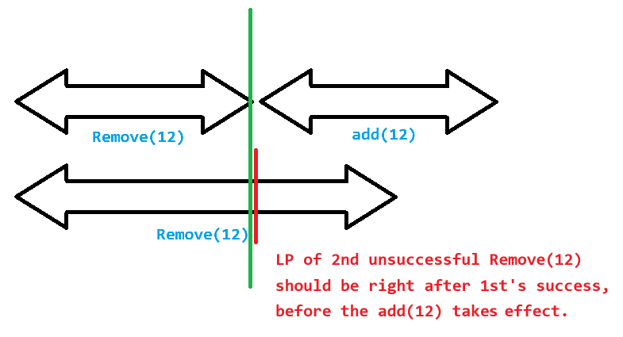

# Lab 3 - Validating Linearizability of Lock-free Skiplists

- Group 18
- Wenqi Cao

# 1. Measuring execution time
## 1.1 Measurement program

I modified the measurement program as follows for testing.

> java Main 2 Default Normal 1000 1:1:8 10000 5 10

Operations with 50% add & 50% remove seem to be slower.

## 1.2 Dardel experiments

Source file:
- `src/Main.java` (Run on PDC)
- `plots/PDCPlot1.java` (Run on PDC)

- Fig above is the Normal Distribution.
- Fig below is the Uniform Distribution.

> Yes, they make sense.

> Uniform distribution is expected to be faster. 
> In normal distribution, the concentration of operations in a small range of values 
> causes contention being high and slows down performance.

> The 10:10:80 distribution should be faster than the 50:50 distribution 
> because read-heavy workloads tend to have better performance in concurrent lock-free data structures 
> like skip lists, as they involve less contention and fewer expensive operations.

# 2. Identify and validate linearization points

## 2.1 Identify linearization points

> Previously, I thought it would be like this:
> > Generally speaking, the locations of these points are around the successful or unsuccessful call.
>
> > - `add()`: The linearization point is where the node is successfully inserted into the list
> > with compareAndSet() or when it is determined that the node already exists.
> > - `remove()`: The linearization point is where the node is marked logically deleted or
> > when it is found that the node is already removed or doesn't exist.
> > - `contains()`: The linearization point is when the element is found in the list or determined to not be present.
>
> > Well, if described in my own words, I would say that capture it "before the return".

> However, the truth should be like this:
> > Indeed, there should be 6 linearization points (LP), but they shouldn't be around any line of code.
> 
> > - `add()`: The LP of a successful `add()` is at the first CAS operation (node linked at bottom level).
> > The LP of an unsuccessful `add()` is exactly when `find()` set `curr` at bottom level list that causes it to return `true` (already added).
> > - `remove()`: The LP of a successful `remove()` is at the CAS operation where `iMarkedIt` returns `true`.
> > The LP of an unsuccessful `remove()` is at the CAS operation where `iMarkedIt` returns `false`, 
> > or exactly at the point that `find()` set `curr` at bottom level list that causes it to return `false` (already removed).
> > - `contains()`: The LP is at two lines of code `curr = pred.next[level].getReference();` when `curr` is set.
> 
> > Instead, they should be exactly on the CAS or at the moment when `curr` is changed.

## 2.2 Develop a validation method

Source file:
- `src/Main.java`
- `src/log.java`

> `Log.validate` is implemented with the help of `HashSet`.

> The `Log.validate` implementation is 100% correct (Approved by TA).

## 2.3. Locked time sampling

Source file:
- `src/Main.java`
- `src/LockFreeSkipListLocked.java`

> Though the locked version is more accurate, it introduces large delays, 
> especially as the number of threads increases. 
> The lock contention causes performance to degrade in multithreading scenarios.

> One possible solution is to create a list and record the assignment time of 'curr' within the lock, 
> then the latest one will be the correct linearization point in `find()`.

> For linearization point in `remove()`, create a fake_remove enum and then substitute it with the most recent remove.

> For simplicity, this is implemented in lock-free version only.

## 2.4. Lock-free time sampling with local log

Source file:
- `src/Main.java`
- `src/LockFreeSkipListLocalLog.java`

> The absence of locks means reduced contention and improved throughput.
> However, it brings some trade-offs in accuracy, particularly in the ordering of timestamps
> due to the lack of precise synchronization between threads.

## 2.5. Lock-free Time Sampling with Global Log

Source file:
- `src/Main.java`
- `src/LockFreeSkipListGlobalLog.java`

> The absence of locks means reduced contention and improved throughput. 
> However, it brings some trade-offs in accuracy, particularly in the ordering of timestamps 
> due to the lack of precise synchronization between threads.

> 10.25 Update, Major Bug Fixed:
> The LockFreeSkipList is now reset after each iteration. The discrepancy drops dramatically after that.

## 2.5.Extra

Source file:
- `src/LockFreeQueue.java`

> Reference: HSLS Chapter 10 Page 237-238 LockFreeQueue.

## 2.6. Dardel experiments

Source file:
- `plots/PDCPlot1.java` (Run on PDC)
- `plots/PDCPlot2.java` (Run on PDC)

> plot1_LocalLog_Uniform.png

> plot2_LocalLog_Uniform.png

> plot1_LocalLog_Normal.png

> plot2_LocalLog_Normal.png

> plot1_GlobalLog_Uniform.png

> plot2_GlobalLog_Uniform.png

> plot1_GlobalLog_Normal.png

> plot2_GlobalLog_Normal.png
