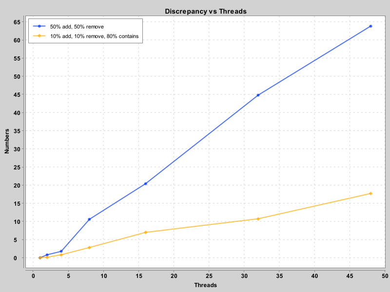
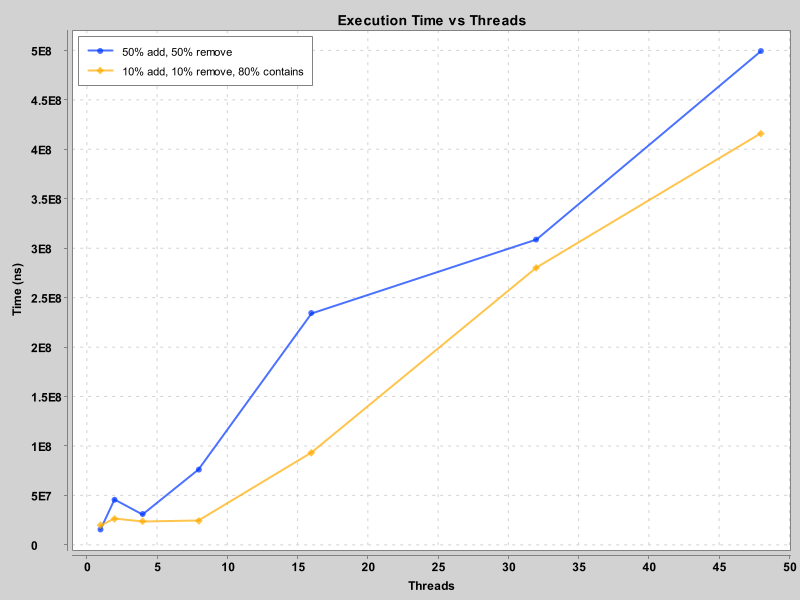
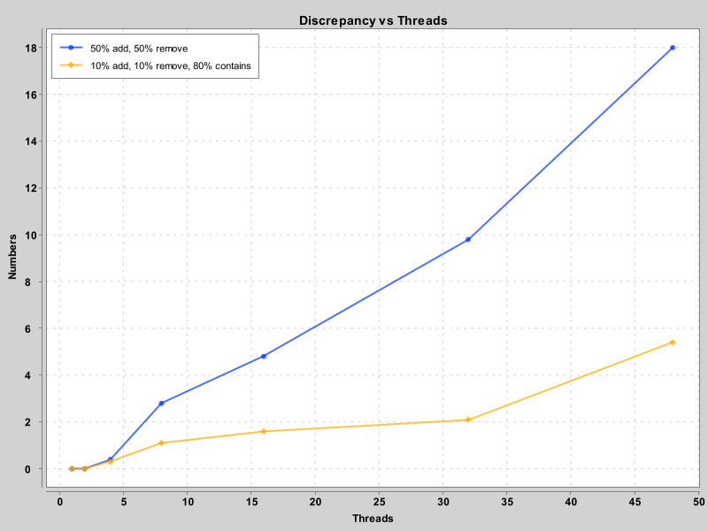
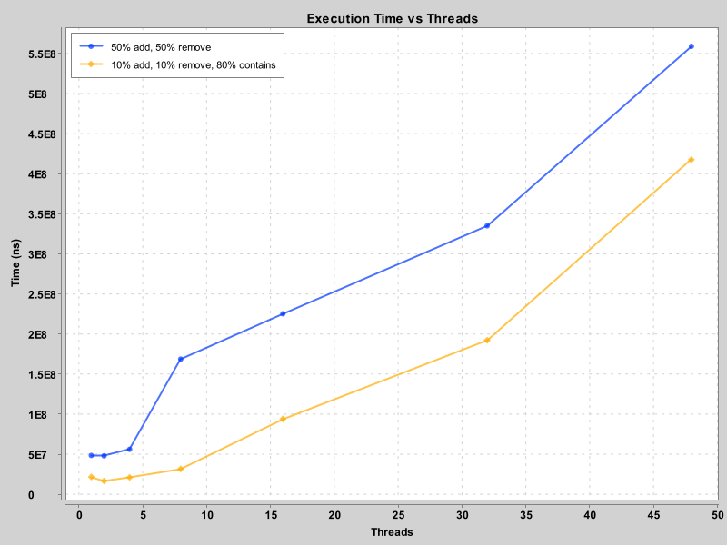
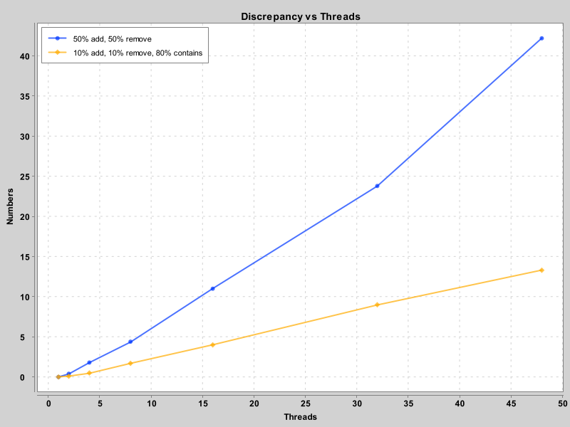

# Lab 3 - Validating Linearizability of Lock-free Skiplists

- Group 18
- Wenqi Cao

# 1. Measuring execution time
## 1.1 Measurement program

I modified the measurement program as follows for testing.

> java Main 2 Default Normal 4096 1:1:8 100000 20 50

Operations with 50% add & 50% remove seem to be slower.

## 1.2 Dardel experiments

Source file:
- `src/Main.java` (Run on PDC)
- `plots/PDCPlot1.java` (Run on PDC)

- Fig above is the Normal Distribution.
- Fig below is the Uniform Distribution.

> Yes, they make sense.

> Uniform distribution is expected to be faster. 
> In normal distribution, the concentration of operations in a small range of values 
> causes contention being high and slows down performance.

> The 10:10:80 distribution should be faster than the 50:50 distribution 
> because read-heavy workloads tend to have better performance in concurrent lock-free data structures 
> like skip lists, as they involve less contention and fewer expensive operations.

# 2. Identify and validate linearization points

## 2.1 Identify linearization points

> Generally speaking, the locations of these points are around the successful or unsuccessful call.

> - `add()`: The linearization point is where the node is successfully inserted into the list 
> with compareAndSet() or when it is determined that the node already exists.
> - `remove()`: The linearization point is where the node is marked logically deleted or 
> when it is found that the node is already removed or doesn't exist.
> - `contains()`: The linearization point is when the element is found in the list or determined to not be present.

> Well, if described in my own words, I would say that capture it "before the return".

## 2.2 Develop a validation method

Source file:
- `src/Main.java`
- `src/log.java`

> `Log.validate` is implemented with the help of `HashSet`.

## 2.3. Locked time sampling

Source file:
- `src/Main.java`
- `src/LockFreeSkipListLocked.java`

> Though the locked version is more accurate, it introduces large delays, 
> especially as the number of threads increases. 
> The lock contention causes performance to degrade in multithreading scenarios.

## 2.4. Lock-free time sampling with local log

Source file:
- `src/Main.java`
- `src/LockFreeSkipListLocalLog.java`

## 2.5. Lock-free Time Sampling with Global Log

Source file:
- `src/Main.java`
- `src/LockFreeSkipListGlobalLog.java`

> The absence of locks means reduced contention and improved throughput. 
> However, it brings some trade-offs in accuracy, particularly in the ordering of timestamps 
> due to the lack of precise synchronization between threads.

## 2.5.Extra

Source file:
- `src/LockFreeQueue.java`

> Reference: HSLS Chapter 10 Page 237-238 LockFreeQueue.

## 2.6. Dardel experiments

Source file:
- `plots/PDCPlot1.java` (Run on PDC)
- `plots/PDCPlot2.java` (Run on PDC)

